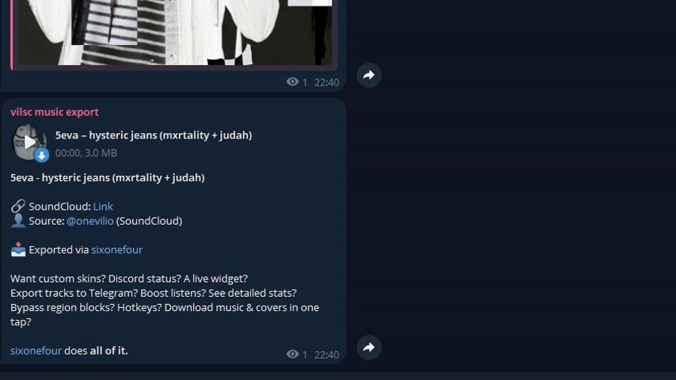
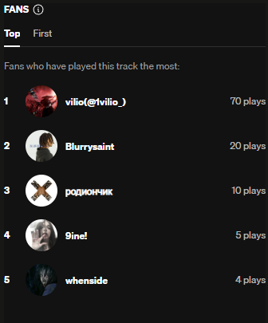

# <p align="center"></p>

<h1 align="center">sixonefour</h1>

<p align="center">
  <strong>A high-performance, aesthetically driven SoundCloud desktop client.</strong><br>
  Where advanced engineering meets experimental design.
</p>

<p align="center">
  
  
  
</p>

---

<p align="center">
  <strong><a href="#english-version">English</a></strong> | <strong><a href="#russian-version">Русский</a></strong>
</p>

---

<a name="english-version"></a>

## 🌐 English Version

### Project Overview

**sixonefour** is not just another wrapper. It is a feature-rich, optimized SoundCloud client designed for users who
demand both visual excellence and technical depth. Built on a modular Electron architecture, it integrates real-time
stats, automation tools, and a proprietary theme engine.

### � Core Capabilities

- **Modular Theme Engine:** Full CSS/Manifest control with video background support.
- **Advanced Automation:** Telegram Feed integration and Fans-category boosting.
- **Network Resilience:** Native support for Zapret, Proxy, and DNS mapping.
- **Ecosystem Integration:** Discord Rich Presence with live preview and synced desktop widget.

---

### 🔍 Feature Breakdown

<details>
<summary><strong>� Custom Themes & Visual Engine</strong></summary>

The client features a robust theming system that goes beyond simple color swaps. It supports live CSS injection and
manifest-based theme packages.

- **Dynamic Media:** Seamless integration of `.mp4` and `.webm` video backgrounds with adjustable blur.
- **Branding Control:** Fully customizable UI elements, including logos and scrollbars.
- **Developer Ready:** Real-time hot-reloading for theme creators.

|                                              |                                              |
| :------------------------------------------: | :------------------------------------------: |
|  |  |
|  |  |

> [!TIP] Refer to the [Theming Guide](docs/CUSTOM_THEMES.md) and [Selectors List](docs/SELECTORS_LIST.md) for advanced
> customization.

</details>

<details>
<summary><strong>🪟 Desktop Widget (Glass Architecture)</strong></summary>

A floating, interactive player designed with glassmorphism principles. The widget is fully synchronized with the main
client's state and visual style.

- **Visual Parity:** Automatically inherits video backgrounds, fonts, and colors from the active theme.
- **Resource Efficient:** Uses optimized BrowserViews to maintain zero impact on system performance.
- **Interactive Controls:** Micro-animations for playback management and track info display.

<p align="center">
  
</p>
</details>

<details>
<summary><strong>🎮 Discord Rich Presence</strong></summary>

Advanced activity tracking for your Discord profile. Highly customizable to show exactly what you want.

- **Precision Tracking:** Displays artist, artwork, and real-time playback progress.
- **Status Preview:** A live "What others see" window in the F1 settings menu.
- **Custom Metadata:** Enhanced track detection for better accuracy.

<p align="center">
  
</p>
</details>

<details>
<summary><strong>✈️ Telegram Integration</strong></summary>

Bridge the gap between SoundCloud and Telegram with automated feed management and library exports.

- **Live Feed Tracking:** Automatically mirrors your "Liked" tracks to a private or public channel.
- **Weekly Analytics:** Generates aesthetic infographics of your weekly listening habits.
- **Metadata Management:** Comprehensive export of track titles, artists, and high-quality artwork.

|                  Live Feed                   |                         Weekly Stats                         |
| :------------------------------------------: | :----------------------------------------------------------: |
|  |  |

> [!IMPORTANT] **Requirements:**
>
> 1. The bot must be added to your channel with **Administrator permissions**.
> 2. Ensure **`Enable Track Parser`** is switched **ON** in the F1 settings for proper metadata extraction.

<p align="center">
  <strong>Mass Export Preview:</strong><br>
  
</p>
</details>

<details>
<summary><strong>🌐 Network & Bypass Tools</strong></summary>

Built-in solutions to maintain connection stability and bypass regional restrictions.

- **Zapret Service:** Integrated DPI bypass for unrestricted track streaming.
- **Custom DNS Mapping:** Hard-coded host-resolver rules for SoundCloud domains.
- **Proxy Engine:** Full support for custom proxy configurations.
  </details>

<details>
<summary><strong>📈 Fans Boosting (Behavior Simulation)</strong></summary>

A sophisticated tool designed to improve track placement in the "Fans" category using human-like behavior simulation.

- **Organic Patterns:** Randomizes listening duration (80-100% full listens vs. short samples) to mimic real users.
- **Hardware Fingerprinting:** Spoofs viewport metrics, Device Scale factors, and User-Agents via Chrome DevTools
  Protocol (CDP).
- **Intelligent Scheduling:** Distributes plays over hours to maintain a natural growth curve.

<p align="center">
  
</p>

> [!WARNING] This feature requires **`Enable Track Parser`** to be active in the F1 settings to correctly identify track
> parameters.

</details>

---

### � Project Roadmap

The following features are planned for future releases:

1. **WebSocket Synchronization:** Listen to music in real-time with friends.
2. **First-Launch Experience:** Interactive tutorial and setup wizard for new users.
3. **In-Game Overlay:** Manage playback without leaving your active game.
4. **Cinematic Integration:** Automatic YouTube clip lookup/preview when opening a track.

---

### 🚀 Setup & Installation

1. **Download:** Get the latest installer from the [Releases](https://github.com/1vilio/sixonefour/releases) page.
2. **Access:** Launch the app and press **`F1`** to open the Command Center.
3. **Requirement:** For downloading and Telegram features, ensure **`Enable Track Parser`** is enabled.

---

### 🛠 Technical Build

```bash
# Clone and install dependencies
git clone https://github.com/1vilio/sixonefour.git
npm install

# Development
npm run dev

# Build (Windows)
npm run build-win
```

---

<a name="russian-version"></a>

## 🇷🇺 Русская версия

### О проекте

**sixonefour** — это не просто оболочка, а многофункциональный оптимизированный клиент SoundCloud, созданный для тех,
кому важен как эстетический вид, так и технические возможности. Клиент построен на модульной архитектуре Electron и
включает в себя статистику в реальном времени, инструменты автоматизации и мощный движок кастомных тем.

### 🔍 Подробный разбор функций

<details>
<summary><strong>🎨 Кастомные темы и визуальный движок</strong></summary>

Система тем позволяет полностью изменять интерфейс через CSS и JSON манифесты.

- **Видео-фоны:** Поддержка `.mp4` и `.webm` фонов с эффектом размытия (Blur).
- **Полный контроль:** Возможность замены логотипов, настройки скроллбаров и шрифтов.
- **Hot-Reload:** Обновление тем в реальном времени без перезагрузки приложения.

|                                              |                                              |
| :------------------------------------------: | :------------------------------------------: |
|  |  |
|  |  |

</details>

<details>
<summary><strong>🪟 Десктопный виджет (Glass Architecture)</strong></summary>

Плавающий плеер с эффектом стекла, полностью синхронизированный с основным приложением.

- **Визуальное единство:** Наследует видео-фон, цвета и шрифты активной темы.
- **Оптимизация:** Минимальное влияние на систему благодаря использованию BrowserViews.
- **Управление:** Интерактивные кнопки и микро-анимации.

<p align="center">
  
</p>
</details>

<details>
<summary><strong>✈️ Интеграция с Telegram</strong></summary>

Автоматизация вашего музыкального потока: отLive-фида до экспорта всей библиотеки.

- **Live Feed:** Автоматическая пересылка каждого вашего "лайка" в Telegram канал.
- **Еженедельная статистика:** Красивые инфографики прослушиваний за неделю.
- **Массовый экспорт:** Перенос всей коллекции треков в один клик.

> [!IMPORTANT] **Требования:**
>
> 1. Бот должен быть добавлен в ваш канал с **правами администратора**.
> 2. В настройках (F1) должен быть включен пункт **`Enable Track Parser`**.

</details>

<details>
<summary><strong>📈 Fans Boosting (Симуляция поведения)</strong></summary>

Инструмент для улучшения позиций трека в категории "Fans" через имитацию действий реального пользователя.

- **Органические паттерны:** Рандомизация длительности прослушивания и случайные паузы.
- **Hardware Fingerprinting:** Подмена метрик устройства и User-Agent через протокол CDP.
- **Умное планирование:** Распределение прослушиваний по времени для естественного роста.

> [!WARNING] Для корректной работы требуется включенный **`Enable Track Parser`** в настройках F1.

</details>

---

### � Планы развития (Roadmap)

1. **WebSocket Sync:** Совместное прослушивание музыки с друзьями в реальном времени.
2. **First-Launch Tutorial:** Интерактивное обучение для новых пользователей.
3. **Game Overlay:** Управление музыкой поверх игровых окон.
4. **Cinematic View:** Автоматический поиск и показ клипа с YouTube при открытии трека.

---

### 💖 Acknowledgments

Special thanks to **[richardhbtz](https://github.com/richardhbtz)** for the inspiration and work on
**[soundcloud-rpc](https://github.com/richardhbtz/soundcloud-rpc)**.

---

<p align="center">
  Licensed under <strong>MIT</strong>. Made for the community.
</p>
